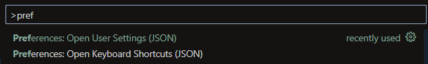

# Dotfiles for VIM like experience in vscode
### Extensions Required for config
- [VsCodeVim](https://marketplace.visualstudio.com/items?itemName=vscodevim.vim)
- [CodeRunner](https://marketplace.visualstudio.com/items?itemName=formulahendry.code-runner)
### Installation
- Open Command Palette
- Find keybindings and settings preferences
- Open and overwrite keybindings.json
- Open and overwrite settings.json

### Keybindings Cheatsheet

#### File Explorer
- Toggle Sidebar (NerdTree): `Space + e`
- New File: `a`
- New Folder: `f`
- Copy: `c`
- Paste: `p`
- Delete: `d`

#### Terminal
- Toggle Terminal: `Ctrl + \`
- Run Code in Terminal: `<leader> r`
#### Navigation
- Leader key set to : `<space>`
- Split Vertical: `<leader> v`
- Split Horizontal: `<leader> s`
- Navigate Left Pane: `<leader> h`
- Navigate Down Pane: `<leader> j`
- Navigate Up Pane: `<leader> k`
- Navigate Right Pane: `<leader> l`
#### Intellisense
- Goto Defination `gd`
- Hover Effect `gh`
- Quick Fix Options `gq`
#### Find Files
- Find File by name: `<leader> ff`  
  While on Find File (Quick Open)
  - Next File: `Ctrl+n`
  - Previous FIle: `Ctrl+p`   
- Find File by source(grep): `<leader> fg`  
  While on Find by Source 
  - Next Result: `Ctrl+n`
  - Previous Result: `Ctrl+p` 
#### WIP
- More Intellisense keybindings

#### References
- [Reference 1](https://dev.to/ansonh/10-vs-code-vim-tricks-to-boost-your-productivity-1b0n)
- [Reference 2](https://code.visualstudio.com/docs/getstarted/keybindings)
- [Reference 3](https://code.visualstudio.com/api/references/when-clause-contexts)

